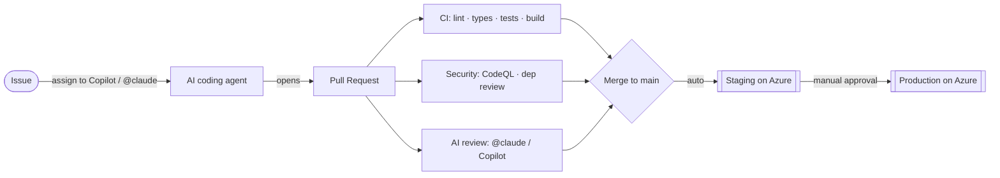

# Agentic Engineering

A reference **agentic software development lifecycle (SDLC)** on GitHub: an issue
is delegated to an AI coding agent, which opens a pull request that automatically
flows through CI, security scanning, AI code review, and **gated deployments to
Azure** — with a human approving production.

[](https://github.com/almaazmi/agentic-engineering/actions/workflows/ci.yml)
[](https://github.com/almaazmi/agentic-engineering/actions/workflows/codeql.yml)

## The loop



Every arrow is automated by a workflow in [`.github/workflows/`](.github/workflows).
The only human gate is approving the production deployment.

## What's inside

| Path | Stack | Purpose |
| --- | --- | --- |
| [`backend/`](backend) | FastAPI · Python 3.12 | In-memory Tasks API with strict typing + 85% coverage gate |
| [`frontend/`](frontend) | Next.js 15 · React 19 · TS | UI that proxies `/api/*` to the backend at runtime |
| [`infra/`](infra) | Terraform · Azure | Container Apps + ACR + Log Analytics, staging & production |
| [`.github/`](.github) | Actions | The pipeline, agent config, templates |

### Architecture

```
Browser ──▶ Frontend (Next.js, Container App :3000)
                 │  server-side proxy  app/api/[...path]/route.ts
                 ▼  BACKEND_URL (runtime)
            Backend (FastAPI, Container App :8000) ──▶ /health, /api/tasks
```

The browser only ever calls the frontend's own origin, so the backend address is
a **runtime** concern — the same image ships to every environment unchanged.

## Pipeline

| Workflow | Trigger | Does |
| --- | --- | --- |
| `ci.yml` | PR, push to main | Backend (ruff/mypy/pytest), frontend (eslint/tsc/vitest/build), terraform fmt+validate, docker builds |
| `codeql.yml` | PR, push, weekly | SAST for Python + JS/TS |
| `dependency-review.yml` | PR | Blocks high-severity / copyleft dependencies |
| `claude.yml` | `@claude` mention | Interactive agent: implements, answers, opens PRs |
| `claude-code-review.yml` | PR opened/updated | Automated AI review |
| `copilot-setup-steps.yml` | Copilot agent | Pre-installs deps in Copilot's sandbox |
| `labeler.yml` | PR | Path-based labels |
| `deploy-staging.yml` → `deploy.yml` | push to main | Build → push to ACR → roll revisions → smoke test |
| `deploy-production.yml` → `deploy.yml` | manual / release | Same, behind the `production` environment approval gate |

## Quickstart (local)

```bash
# Backend  → http://localhost:8000/docs
cd backend && python3.12 -m venv .venv && source .venv/bin/activate
pip install -e ".[dev]" && uvicorn app.main:app --reload

# Frontend → http://localhost:3000   (in another shell)
cd frontend && npm ci
cp .env.local.example .env.local     # BACKEND_URL=http://localhost:8000
npm run dev
```

Run every quality gate the way CI does with `make backend-check frontend-check infra-check`.

---

## Setup

The repo works immediately for CI + security. Two optional integrations light up
the rest: **AI agents** and **Azure deploys**. Until configured, agent and deploy
jobs skip cleanly (no red X's).

### 1. Enable the AI agents

**Claude (`@claude`)**
1. Install the Claude GitHub App: <https://github.com/apps/claude> (select this repo).
2. Add a repository secret `ANTHROPIC_API_KEY` (from <https://console.anthropic.com>):
   ```bash
   gh secret set ANTHROPIC_API_KEY --repo almaazmi/agentic-engineering
   ```
3. Mention `@claude` in any issue or PR comment.

**GitHub Copilot cloud agent**
1. Ensure a paid Copilot plan is active on the `almaazmi` account.
2. Enable the coding agent (Copilot settings), then **assign an issue to Copilot**
   or start a session from the agents panel. It uses `copilot-setup-steps.yml`
   to prepare its environment.

### 2. Configure Azure (OIDC — no stored credentials)

> Replace `SUBSCRIPTION_ID` and pick a globally-unique state storage account name.

**a. Bootstrap Terraform remote state**
```bash
az group create -n tfstate-rg -l uaenorth
az storage account create -n <UNIQUE_SA> -g tfstate-rg -l uaenorth --sku Standard_LRS
az storage container create -n tfstate --account-name <UNIQUE_SA>
```

**b. Create the OIDC app + federated credentials**
```bash
APP_ID=$(az ad app create --display-name agentic-engineering-oidc --query appId -o tsv)
az ad sp create --id "$APP_ID"

# Grant it what the pipeline needs (scope down further if you like)
az role assignment create --assignee "$APP_ID" --role Contributor \
  --scope /subscriptions/SUBSCRIPTION_ID
az role assignment create --assignee "$APP_ID" --role "Storage Blob Data Contributor" \
  --scope /subscriptions/SUBSCRIPTION_ID/resourceGroups/tfstate-rg

# One federated credential per environment (subject = the GitHub environment)
for ENV in staging production; do
  az ad app federated-credential create --id "$APP_ID" --parameters "{
    \"name\": \"gh-$ENV\",
    \"issuer\": \"https://token.actions.githubusercontent.com\",
    \"subject\": \"repo:almaazmi/agentic-engineering:environment:$ENV\",
    \"audiences\": [\"api://AzureADTokenExchange\"]
  }"
done
```

**c. Tell GitHub about it**
```bash
REPO=almaazmi/agentic-engineering
gh secret set AZURE_CLIENT_ID       --repo $REPO --body "$APP_ID"
gh secret set AZURE_TENANT_ID       --repo $REPO --body "$(az account show --query tenantId -o tsv)"
gh secret set AZURE_SUBSCRIPTION_ID --repo $REPO --body "$(az account show --query id -o tsv)"

gh variable set TFSTATE_RESOURCE_GROUP --repo $REPO --body tfstate-rg
gh variable set TFSTATE_STORAGE_ACCOUNT --repo $REPO --body <UNIQUE_SA>
gh variable set TFSTATE_CONTAINER       --repo $REPO --body tfstate
```

**d. Create the environments + production approval gate**
```bash
# staging: no gate. production: require yourself as a reviewer.
gh api -X PUT repos/almaazmi/agentic-engineering/environments/staging
gh api -X PUT repos/almaazmi/agentic-engineering/environments/production \
  -f "reviewers[][type]=User" -F "reviewers[][id]=$(gh api user --jq .id)"
```

That's it. The next merge to `main` deploys to **staging**; run **Deploy
Production** (or publish a release) to ship to **production** after approval.

## Using it end to end

1. Open an issue (try the **Agent task** template).
2. Assign it to **Copilot**, or comment `@claude implement this`.
3. The agent opens a PR. CI, CodeQL, dependency review, and the AI reviewer run.
4. Address feedback (`@claude address the review`), then merge.
5. Staging deploys automatically; the run summary links the live URLs.
6. Approve **Deploy Production** to promote.

## Security posture

- **No long-lived cloud credentials** — GitHub → Azure via OIDC federation.
- **Least-privilege** workflow permissions; secrets only where needed.
- **SAST** (CodeQL) + **supply-chain** (dependency review, Dependabot, `npm audit`).
- ACR admin user disabled; container apps pull via managed identity.
- Production requires **human approval**.

## License

[MIT](LICENSE)
